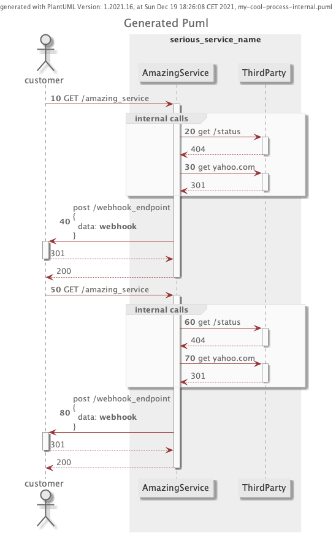

# Puml Generator for Elixir/Phoenix Projects

Documenting business logic of a service and keeping it up to date is one of the most complex tasks in the software development. 
Sequence diagrams have been a very useful tool to achieve this task but their creation takes some effort and they get out to date pretty fast. 

This repository offers an automated way of doing this based on logs of the api calls with the goal to have an automated way to generate sequence diagrams of a service
and keep them up to date with less effort.

The project contains a simple phoenix project with a controller that makes 3 simple calls, the puml generator that generates PUML files and together with a script, generates the sequence diagrams.

The following sequence diagram is automatically generated from `page_controller_test.exs`:



### About the implementation
- the generation is based on Logs from Logger, Plug.Logger, PumlGenerator.PumlLogger and the hackney debug logs
- those logs are collected by the PumlBackend translated into puml `items` stored in the ETS cache
- a post-processor sets the puml participants to the `items` and marks each `item` as public or internal based on the url_participant_map
- at the end of the process the puml is written as a file to the configured path
- together with the macros in the puml_lib the final sequence diagrams can be generated

In my experience every business case is different and would have very specific requirements, making a generic library something pretty difficult to maintain.

## Getting started
preconditions:
- elixir 1.12
- java 8?

commands:
- clone repo
- `mix test && ./generate_puml.sh`

### Integration into other projects
- copy the `puml_generator_lib` folder to your project
- add `plug(PumlGenerator.PumlLogger)` to `endpoint.ex`
- use PumlGenerator.Generator in your integration test parametrized as described in [Parameters](#Parameters). 
  - The configuration will be the heart of your diagrams, specially the url_participant_map   
- use the methods from PumlGenerator.Generator to log start, end, opt-start, opt-end, webhooks and sqs messages in your integration test
- enable generator by setting environment variable `GENERATE_PUML=true`
- run your specific test
- the puml is created in the configured path
- modify the script `generate_puml.sh` to generate png and svg with and without internal calls of the generated puml

### Example
#### Configuration
```
config :puml_generator, PumlGenerator.Generator,
  allowed_url_parts:
    ~w(amazing_service google.com yahoo.com status customer.com webhook_endpoint),
  allowed_request_params: ~w(somedata moredata data),
  allowed_response_params: ~w(somedata data),
  value_params: ["data"],
  self: "amazing_service",
  actor: "customer",
  public: "serious_service_name",
  participants: [
    {"amazing_service", "AmazingService"},
    {"tp", "ThirdParty"}
  ],
  url_participant_map: [
    {"/status", :self, "tp", true},
    {"yahoo", :self, "tp", true},
    {"amazing_service", :actor, :self},
    {"/webhook_endpoint", :self, :actor}
  ]

```
#### Usage
```
use PumlGenerator.Generator

test "my test", %{conn: conn} do
  record_puml(path: "process.puml")
  do_interesting_stuff()

  puml_opt_start("optional part")
  do_optional_stuff()
  puml_opt_end()

  end_interesting_stuff()
  save_puml()
end
```

### Parameters
The following parameters can be configured as :my_app_name, PumlGenerator.Generator in the env config,
when using the macro or passed to the function record_puml. 
The configuration will be overriden in that order

| parameter name          | description                                                                                                                                                                                                                                                | example                                            |
|-------------------------|------------------------------------------------------------------------------------------------------------------------------------------------------------------------------------------------------------------------------------------------------------|----------------------------------------------------|
| path                    | path to generate puml. the file will be removed before start                                                                                                                                                                                               | "path/to/process.puml"                             |
| allowed_url_parts       | parts of the url that will not be masked. every url part must be listed                                                                                                                                                                                    | ~w(endpoint v1 internal)                           |
| allowed_request_params  | parameters of the request to be shown                                                                                                                                                                                                                      | ~w(account id  status)                             |
| allowed_response_params | parameters of the response to be shown                                                                                                                                                                                                                     | ~w(id confirmed_at status limit)                   |
| value_params            | parameters which values should be shown as they are                                                                                                                                                                                                        | ~w(status limit)                                   |
| self                    | puml participant id of the service                                                                                                                                                                                                                         | "my-service"                                       |
| actor                   | puml actor initiating the processes                                                                                                                                                                                                                        | "my-customer"                                      |
| public                  | identifier for public participant                                                                                                                                                                                                                          | "public-participant"                               |
| participants            | list of `{participant_id, participant_description}`                                                                                                                                                                                                        | [{"part1", "Participant"]}                         |
| url_participant_map     | list of `{[url-substring], from_participant, to_participant, internal?}` which defines what call goes from which participant to which participant. The url must not be written in its full extension. The library checks for substrings in the logged url. | [{"/internal/service", :self, "Backoffice", true}] |
